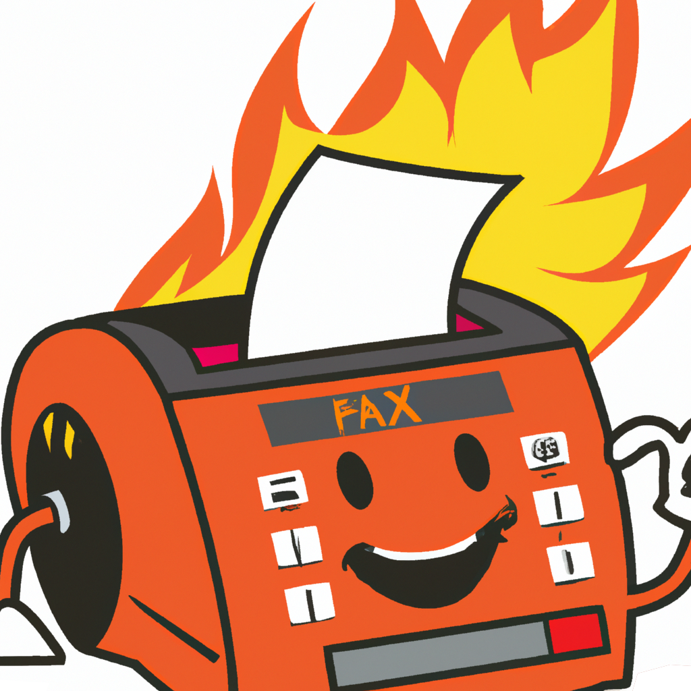
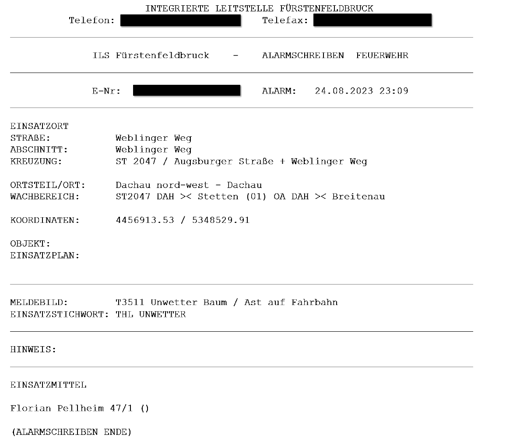
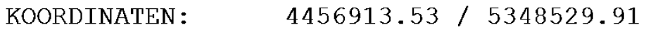
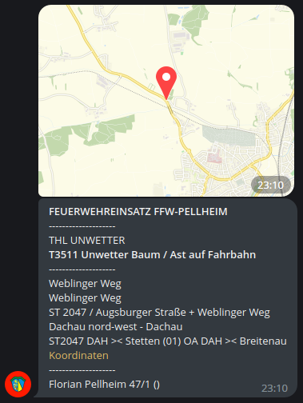

# Firefax

Firefax is an error-tolerant Rube Goldberg machine deployed to production in a most-critical environment.

### Backstory:

It turns out, that it is a significant hurdle for our dispatch & control center to send alert notifications
about upcoming emergencies directly to the phones of the members of our local volunteer fire-department.

The only official form of communication used,
is an analogue radio transmission - used to activate sirens,
as well as an **alert fax** sent on an **analogue telephone line**.

This is obviously not very useful, as fax machines are neither mobile, digital, nor interactive
(and people generally refuse to carry them around in their pockets at their day jobs).

As I consider this state of technology unacceptable,
I set out to digitize this process by implementing a notification system myself.

### Components:

#### 1. Fax:

[Fax](https://en.wikipedia.org/wiki/Fax) consists of a **bitmap representation of a black-and-white image**.
There is no embedded metadata, error correction or digital representation of contained text in the format.

#### 2. Fax-to-PDF:

As I do not have fax machine and refuse to buy one,
I settled on our consumer grade FritzBox router that happens to have a built-in Fax-to-PDF converter.
Their implementation of this converter is neither sophisticated, nor open-source,
so the PDF I get out of this is still an image representation of the text as a PDF:

#### 3. PDF-to-Email

The router does not provide any API that would allow me to receive a notification
or dispatch a webhook when a new fax is received.
In fact, the only useful feature is
that I can configure the router to send myself an email,
with the PDF as attachment.

#### 4. Email-to-PDF

As I don't know when I'll receive an email, and the received mail is time-critical,
we [poll the inbox](https://github.com/Valentin-Metz/firefax/blob/master/src/mail_receiver.py) for new emails every 2
seconds.
We then downloads the attachment of every email received
from the correct sender with the correct subject line,
and parses it for keywords.

#### 5. PDF-to-Text

Since there is no digital representation of the text contained in the PDF,
the only remaining way was to use an OCR library and attempt to parse it letter by letter.
[Tesseract OCR](https://github.com/tesseract-ocr/tesseract) provides a mature OCR tool with excellent python
integration,
achieving around 95% accuracy on keywords.

#### 6. RegEx

As the accuracy is not perfect,
we match specific regions of the received fax to keywords.
Specific characters, like `I`, `L` and whitespace sequences can be a problem,
so we [match](https://github.com/Valentin-Metz/firefax/blob/master/src/fax_parser.py) with tolerance for these.
Empty regions are discarded to keep the final output brief.
Regions where the keyword fails to parse are skipped,
so that we can still output notifications, even if we receive something badly malformed or illegible.

#### 7. Parsing coordinates

The PDF occasionally contains coordinates of where we are needed.
It would be very useful to be able to view these in a navigational app,
so that we do not have to orientate ourselves by street name in an area we might not know.
The coordinates are not given in a modern format,
like longitude and latitude, but
using [Gauss-Krüger offsets](https://de.wikipedia.org/wiki/Gau%C3%9F-Kr%C3%BCger-Koordinatensystem),
a format established by the German military in **1935**:

Since Google Maps has no support for or knowledge of this format,
the coordinates need to be converted before use.
Finding the correct conversion algorithm was a challenge in itself,
since Gauss-Krüger is not a single format,
but two shift-distances used to calculate an offset from a known fixpoint.
The fixpoint used as reference is not documented anywhere I have access to,
so it required some reverse-engineering and trial-and-error with a cartographic projection library to identify.

#### 8. Telegram

Finally, we need a [distribution system](https://github.com/Valentin-Metz/firefax/blob/master/src/telegram_bot.py)
to actually send the notifications to the members of the fire-department.
After some experimentation, I settled on [Telegram](https://core.telegram.org/bots),
mostly due to their excellent support for bots and in-message location rendering.
Sign-up is secured by a pre-shared secret key, so that alert notifications remain confidential.
Messages are composed with a focus on readability,
so that all critical information is available at glance.

### Results:

While this solution is neither elegant, nor optimal,
it has turned out to be of great use.

This is the final message that we send out to members of the fire-department.
It offers easy access to navigation instructions and summarizes all important information in one message.
It can be read and understood by a non-tech-savvy person in a matter of seconds,
and is available on their phone at all times, even after a loss of internet connectivity.

All of this was built and deployed on a single weekend, with about 20 engineering hours.\
It is now running in production, without incident, maintenance or downtime, for almost two years.
